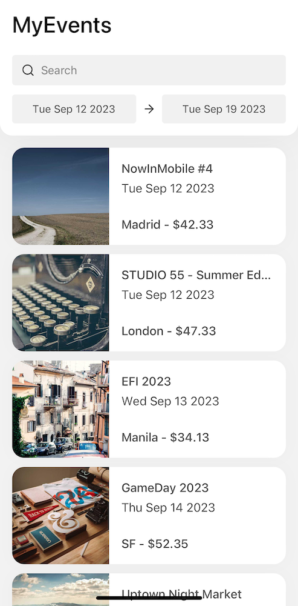

## Example Events App



This setup uses Expo. Easiest way to test the app is to install Expo Go App on a mobile phone or to use a simulator.

Setup:

```bash
npm install
npm start

# scan code with Expo App or use simulator

#test
npm run test
```

## Note

The UI framework used here, https://ui.gluestack.io/, is currently in the beta phase, and the authors of https://nativebase.io are developing it.  
In the real app, the cart should be implemented and synced on the backend.

## Sample User Stories

#### Event Listing:

As a user, I want to view a list of events with their basic details, so that I can discover interesting events.

#### Date Range Filters:

As a user, I want to filter events by specific date ranges with start and end dates, so that I can narrow down my search.

#### Event Search:

As a user, I want to search for events by keywords so that I can quickly find events that match my preferences.

##### Event Details:

As a user, I want to click on an event to view its details (e.g., date, location, price), so that I can learn more about it.

#### Add Events to Basket:

As a user, I want to add events to my basket for later purchase, so that I can keep track of events I'm interested in attending.

#### Basket Management:

As a user, I want to view and manage the events in my basket (e.g., remove items, adjust quantities), so that I can organize my event selections.
